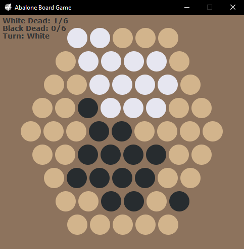

# Abalone
Coding project based on the board game abalone.
- The basic rules of the game can be found here: https://cdn.1j1ju.com/medias/c2/b0/3a-abalone-rulebook.pdf

## Usage
java abalone.main [setting] [GUI] [AI player] [Number of AI players]*

Setting:
- "default" - begins a game with the standard, default layout of 2-player abalone

GUI:
- "true" - enables GUI
- "false" - plays and displays game through terminal
- 

AI Player:
- "true" - allows one or two players to be an AI
- "false" - begins a game with two manual players, with black starting first

Number of AI Players (only required if AI player = true):
- "1" - begins a game with black starting first and an AI playing as white\
- "2" - begins a game where both players are AI's

## Move Notation
The notation used for this implementation follows the standard abalone rules for move notation.
- You can access them here: http://www.gamerz.net/pbmserv/abalone.html

